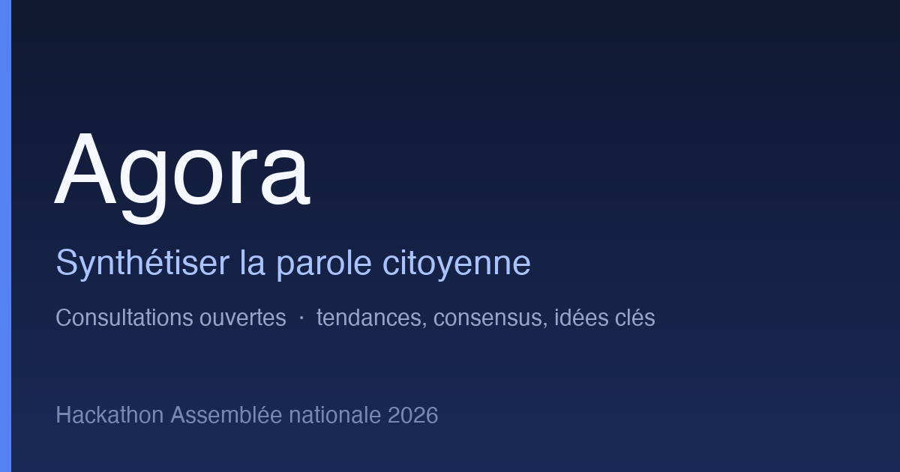

### Nom du défi
Agora — synthétiser la parole citoyenne

### Description courte
Une place d'expression ouverte qui agrège les consultations citoyennes de
l'Assemblée et en fait ressortir, de manière transparente, les tendances, les
points de convergence et les idées les plus représentées.

### Porteur
Équipe Agora

### Description longue
**Contexte.** Lorsque des commissions réalisent des consultations citoyennes,
elles posent parfois des questions ouvertes pouvant recueillir **plusieurs
dizaines de milliers de réponses** (33 609 pour la seule consultation TikTok).
Leur analyse manuelle est coûteuse et lente, et nécessite une méthodologie pour
faire ressortir les points communs de ces retours.

**Enjeu.** Comment extraire les tendances, les points de convergence et les
idées les plus pertinentes d'un grand volume de réponses en langage naturel,
de manière **transparente** et **reproductible** ?

**Objectifs.**
- Inclure le citoyen au centre du débat politique en lui offrant un moyen
  d'expression.
- Équiper les membres de l'Assemblée d'une visualisation fiable et intuitive des
  positions les plus représentées et des axes de consensus.
- Faciliter l'ingestion des données agrégées lors des consultations citoyennes —
  réduction des coûts et du temps.

**Trois engagements, tenus de bout en bout.**
- 🔍 **Fidèle** — zéro reformulation : chaque extrait affiché est une sous-chaîne
  exacte du texte citoyen.
- 🧭 **Traçable** — chaque thème émane des idées extraites des témoignages, et se
  remonte jusqu'au verbatim exact qui le compose.
- 🔒 **Souverain** — embeddings calculés en local, modèles ouverts.

À cela s'ajoute un principe d'**honnêteté** : les limites de l'analyse sont affichées,
jamais masquées.

**Déroulé / approche.**
1. **Prétraitement** : nettoyage (fautes, doublons), détection de langue,
   anonymisation.
2. **Extraction des positions** : chaque réponse est décomposée en *affirmations
   élémentaires* par un modèle de langage — on analyse les idées qu'elle porte,
   pas seulement le texte entier. **Aucune reformulation** : chaque affirmation est
   un extrait *exact* du texte citoyen, relié à sa réponse d'origine (auditable).
3. **Regroupement émergent** : les affirmations sont représentées par des
   *embeddings* sémantiques calculés **en local** (modèle ouvert, multilingue —
   aucune donnée n'est envoyée à un tiers pour cette étape), puis regroupées par
   détection de communautés sur un graphe de plus-proches-voisins. Aucune liste de
   thèmes n'est fixée à l'avance : ils **émergent** des réponses.
4. **Hiérarchie mesurée, pas décidée** : plutôt que d'imposer un nombre de
   thèmes, on fait varier l'échelle de regroupement (le « zoom ») et on lit la
   structure — grands thèmes puis sous-thèmes — là où les niveaux s'emboîtent le
   plus proprement. C'est le corpus qui dicte sa granularité et son nombre de
   niveaux, pas un paramètre arbitraire.
5. **Nommage transparent** : titres et mots-clés sont dérivés des réponses
   elles-mêmes, jamais d'une catégorie plaquée ; chaque thème se remonte jusqu'aux
   verbatims qui le composent.
6. **Opinion & consensus** : pour chaque thème, les points de convergence, les
   axes de désaccord et la part de voix qu'ils représentent.
7. **Visualisation & validation humaine** : une carte navigable des thèmes, avec
   exploration des réponses individuelles et audit de chaque regroupement.

**Données.** L'Assemblée ne publie pas les réponses brutes des consultations
(données personnelles). Le système est donc entraîné et évalué sur des jeux
**équivalents ou publiés** :
- *Consultation TikTok* (open data Assemblée) — cas réel publié avec une question
  ouverte (33 609 réponses).
- *x-stance* (ZurichNLP) — 150 questions politiques et ~67 000 commentaires de
  candidats, labellisés FAVOR/AGAINST, pour entraîner et évaluer le clustering.

### Image principale

### Contributeurs
- À compléter

### Ressources utilisées
Cochez les ressources utilisées en remplaçant `[ ]` par `[x]`.

- [ ] `openfisca-france-parameters` — Base de données de paramètres ✺ OpenFisca
- [ ] `an-dossiers-legislatifs` — Dossiers législatifs de l'Assemblée nationale (législature courante) ✺ Assemblée nationale
- [ ] `an-amendements-xvii` — Amendements déposés à l'Assemblée nationale (législature actuelle) ✺ Assemblée nationale
- [ ] `an-comptes-rendus` — Comptes rendus de la séance publique à l'Assemblée nationale (législature actuelle) ✺ Assemblée nationale
- [ ] `an-votes-xvii` — Votes des députés (législature actuelle) ✺ Assemblée nationale
- [ ] `an-deputes-en-exercice` — Députés en exercice ✺ Assemblée nationale
- [ ] `an-deputes-historique` — Historique des députés ✺ Assemblée nationale
- [ ] `an-deputes-senateurs-ministres-par-legislature` — Députés, sénateurs et ministres d'une législature ✺ Assemblée nationale
- [ ] `an-agenda-reunions` — Agenda des réunions à l'Assemblée nationale (législature courante) ✺ Assemblée nationale
- [ ] `an-questions-gouvernement` — Questions de l'Assemblée nationale au Gouvernement ✺ Assemblée nationale
- [ ] `an-questions-gouvernement-ecrites` — Questions écrites de l'Assemblée nationale au Gouvernement ✺ Assemblée nationale
- [ ] `an-questions-gouvernement-orales` — Questions orales de l'Assemblée nationale au Gouvernement ✺ Assemblée nationale
- [ ] `premier-ministre-legi` — Codes, lois et règlements consolidés ✺ Premier ministre
- [ ] `premier-ministre-dole` — Dossiers législatifs Légifrance ✺ Premier ministre
- [ ] `premier-ministre-jorf` — Édition ''Lois et décrets'' du Journal officiel ✺ Premier ministre
- [ ] `senat-dispositifs-textes` — Dispositifs des textes déposés ou adoptés au Sénat ✺ Sénat
- [ ] `senat-dossiers-legislatifs` — Dossiers législatifs du Sénat ✺ Sénat
- [ ] `senat-amendements` — Amendements déposés au Sénat ✺ Sénat
- [ ] `senat-senateurs` — Sénateurs ✺ Sénat
- [ ] `senat-questions-gouvernement` — Questions orales et écrites du Sénat au Gouvernement ✺ Sénat
- [ ] `senat-comptes-rendus` — Comptes rendus de la séance publique au Sénat ✺ Sénat
- [ ] `an-et-co-database-regroupement-toutes-donnees` — Base de données unifiée Parlement / Législation / Service Public ✺ Assemblée nationale & communauté
- [ ] `an-et-co-serveur-mcp-regroupement-toutes-donnees` — Serveur MCP  - Accès unifié Parlement / Législation / Service Public ✺ Assemblée nationale & communauté
- [ ] `an-et-co-api-regroupement-toutes-donnees` — API - Accès unifié Parlement / Législation / Service Public ✺ Assemblée nationale & communauté
- [ ] `legiwatch-api-parlement` — API Parlement ✺ LegiWatch
- [ ] `legiwatch-database-parlement` — Base de données Parlement ✺ LegiWatch
- [ ] `legiwatch-serveur-mcp-parlement` — Serveur MCP Parlement ✺ LegiWatch

### Galerie
- À compléter

### Documents
- **Démonstration publique en ligne** : <https://forge.tail0b8aa8.ts.net> — la
  méthode Agora sur des témoignages publics de consultations citoyennes.
